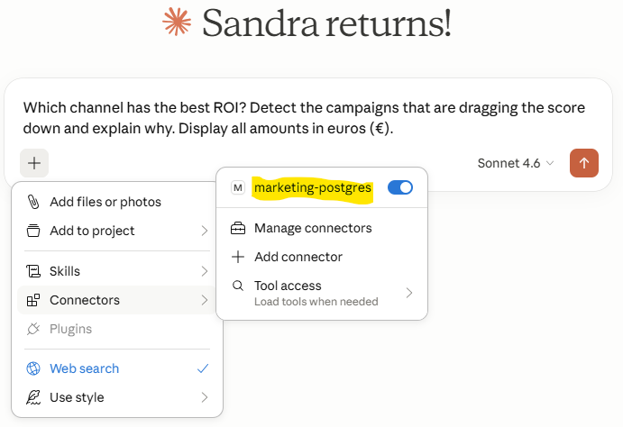
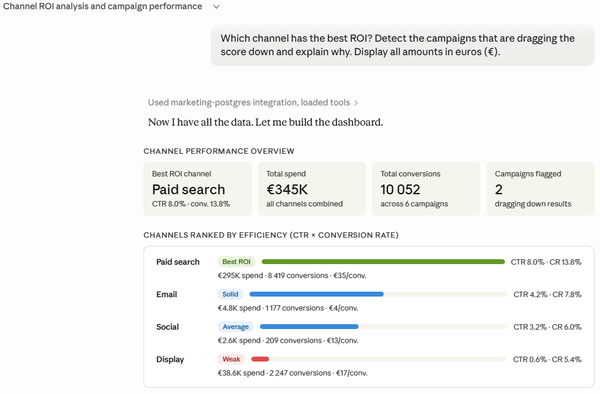

# Controlled AI Access to Marketing Data via MCP

A read-only MCP (Model Context Protocol) server exposing structured marketing analytics to AI assistants via PostgreSQL.

## Overview

This server gives an AI assistant structured access to a marketing analytics database —
campaigns, audiences, conversions — without exposing a raw SQL interface.

Data access is scoped to five explicit tools. The PostgreSQL role is read-only,
and Python enforces the same constraint at session level — so there's no way to bypass it
through the model.

## Demo




## Stack

| Component | Technology |
|-----------|-----------|
| MCP server | Python 3.12 + MCP Python SDK |
| Database | PostgreSQL 16 |
| Orchestration | Docker Compose |
| Data | Synthetic dataset generated at init |

## MCP Tools

| Tool | Description |
|------|-------------|
| `list_campaigns` | All campaigns with channel, status and budget |
| `get_campaign_summary` | Aggregated KPIs for a given campaign |
| `compare_channels` | CTR and conversion rate by channel |
| `detect_underperforming_campaigns` | Campaigns below a CTR threshold |
| `get_daily_trend` | Daily clicks and conversions for a campaign |

## Security Design

- No arbitrary SQL exposed to the LLM
- PostgreSQL role with `SELECT` only
- Session-level `default_transaction_read_only=on`
- All queries are parameterised (no string interpolation)

## Quick Start

```bash
docker compose up --build
```

Connect any MCP-compatible client to the `mcp_server` container via stdio.

## Project Structure

```
├── db/
│   └── init.sql          # Schema + synthetic data
├── mcp_server/
│   ├── db.py             # Database connection layer
│   └── server.py         # MCP tools definition
├── docker-compose.yml
├── Dockerfile
└── requirements.txt
```
## File Reference

| File | Role |
|---|---|
| `docker-compose.yml` | Orchestrates PostgreSQL and the MCP server |
| `db/init.sql` | Schema + 6 campaigns + ~400 rows of daily metrics |
| `mcp_server/db.py` | Read-only connection layer with parameterised queries |
| `mcp_server/server.py` | 5 predefined MCP tools — no arbitrary SQL exposed |
| `Dockerfile` | Minimal Python image |
| `README.md` | Documentation |